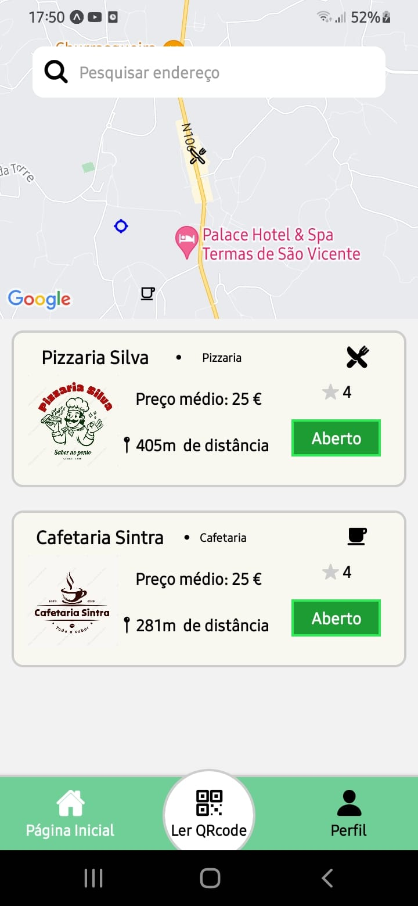
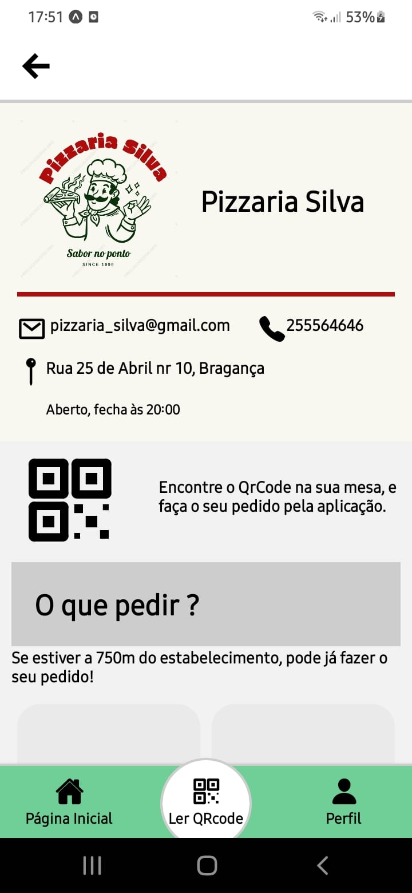

## Development of a Multiplatform Mobile Application for Restaurants, Cafes, and Bars

This application, designed for both iOS and Android platforms, aims to streamline the ordering process at customer tables. 
Users will be able to scan a QR code directly through the app to identify the table number and the establishment.
Once scanned, the user will be redirected to the establishment's page, where they can view the menu and start placing orders.

The software will notify users via push notifications whenever there is an update to the order, whether initiated by the establishment or the customer.

Additionally, the list of nearby establishments will be sorted based on GPS location, ensuring that orders can only be placed when the user is in proximity to the location.

## Development

# Tech Stack 
React Native, Google Firebase, Figma, JavaScript

# Libraries
Expo Tools 

## IDE
Android Studio emulator, Visual Studio Code, Expo Go
